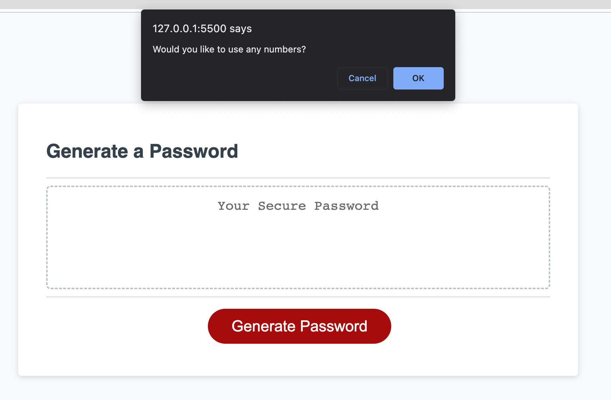

# 03 JavaScript: Password Generator

<h2>The goal:</h2>

Create a random password generator while asking the user questions about character types (lower characters, upper character, numbers or special characters)

<h2>The process:</h2>

First, I broke down the goal into small pieces of logic.
I ended up with three main ideas.
   1. asking the user simple true or false questions, then validating the answers (lowecase, uppercase, numbers, special characters)
   2. generating the password according to the validated data
   3. outputting the generated password through the html element #password

I had to create 4 arrays with characters, then using them to generate strings by randomizing the elements of the array.
I used the sort() method to sort the elements in the array, and the custom function compareRandom() which was passed as an argument, to return a random value. This value is the order in which the array will be sorted. Each time the value being random.

<h2>Interesting facts:</h2>

Some logic was added so the human factor doesn't break the program.
 - I added a user input validation to the number of characters cannot be lower than 8 and higher than 128
 - If the user enters letters an alert message will display asking to enter integers.
 - At least one item beside the number of characters must be true so we prevent getting an empty array.

Deployed website: https://evothinke.github.io/Random-Password-Generator-3/ 
Github Repository: https://github.com/evothinke/Random-Password-Generator-3 

  
This is where the user entered a different character than an integer between 8 and 128.  
